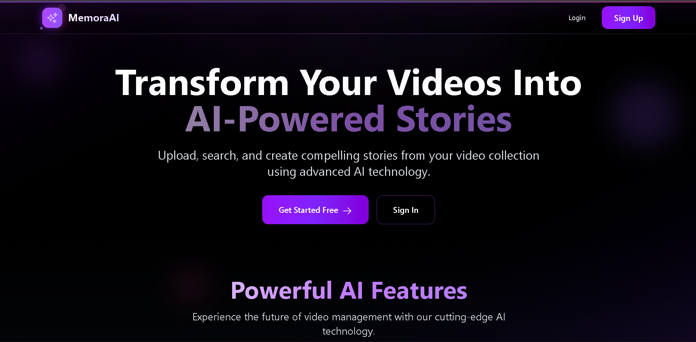
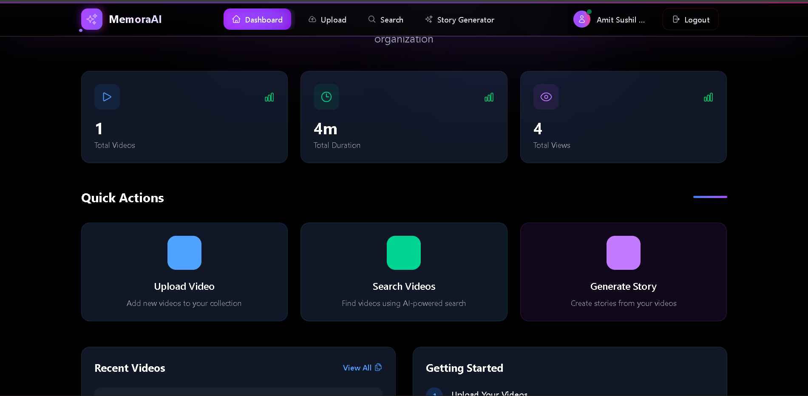
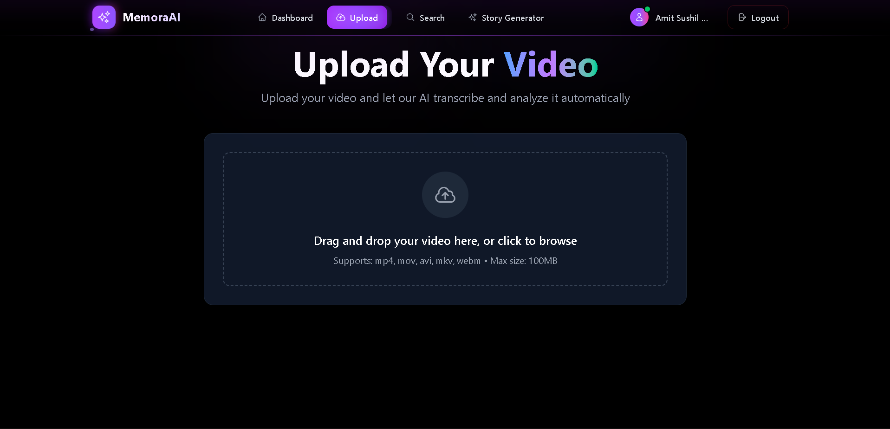
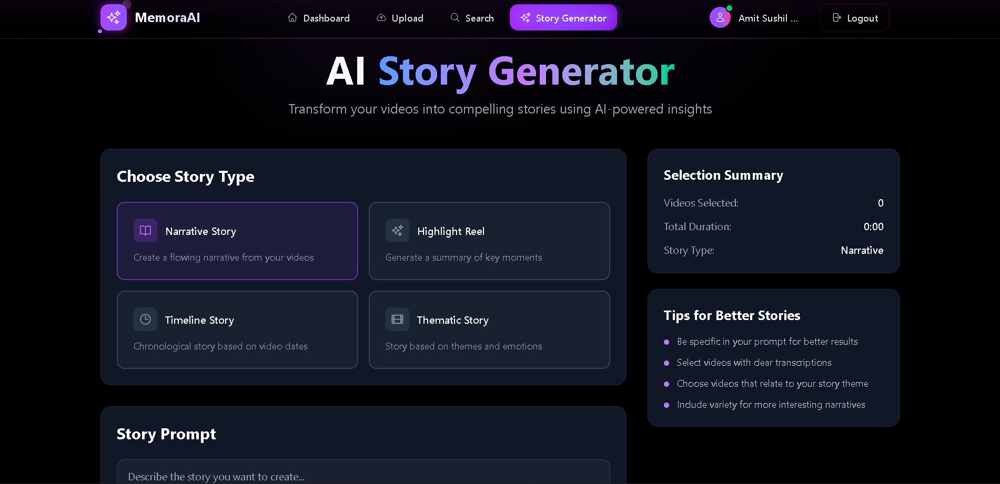
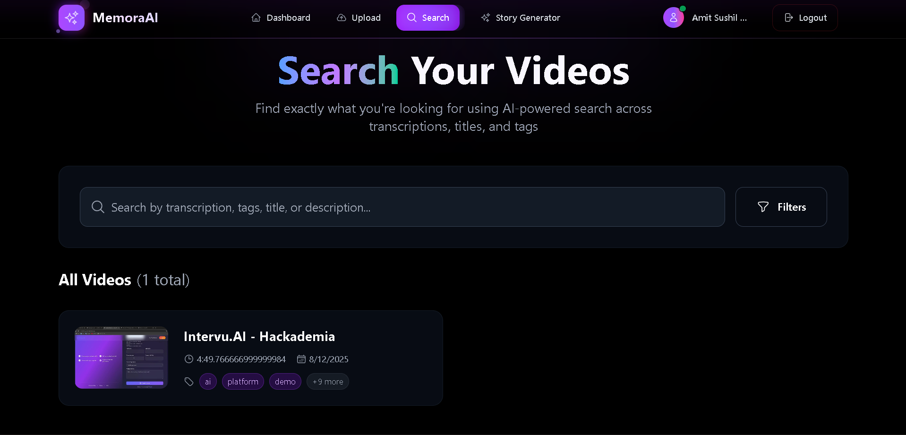

<div align="center">
  
  <h1>MemoraAI</h1>
  <p><em>Capture, store, and relive your precious memories with AI.</em></p>
</div>


**Transform your videos into compelling stories with the power of AI**

[](https://reactjs.org/)
[](https://nodejs.org/)
[](https://mongodb.com/)
[](https://groq.com/)

</div>

---

## 🌟 Overview

VideoStory AI is a cutting-edge platform that leverages artificial intelligence to transform your video content into engaging narratives. Upload your videos, let our AI analyze and transcribe them, then watch as compelling stories emerge from your content using state-of-the-art language models.

### ✨ Key Highlights

- 🤖 **AI-Powered**: Built on Groq's lightning-fast AI infrastructure
- 🎯 **Intelligent Analysis**: Deep content understanding and scene detection
- 📝 **Smart Transcription**: Accurate speech-to-text with advanced models
- 🎨 **Story Generation**: Creative narrative creation from video content
- 🔍 **Advanced Search**: Powerful search across all your content
- 💫 **Modern UI**: Beautiful, responsive interface with smooth animations

---

## 🚀 Features

### 🎥 Video Management
- **Drag & Drop Upload**: Intuitive file upload with progress tracking
- **Smart Processing**: Automatic AI analysis and metadata extraction
- **Cloud Storage**: Secure video storage with Cloudinary integration
- **Batch Operations**: Upload and process multiple videos simultaneously

### 🧠 AI-Powered Analysis
- **Transcription**: Crystal-clear speech-to-text using Whisper-large-v3
- **Content Recognition**: Advanced scene and object detection
- **Sentiment Analysis**: Understand the mood and tone of your content
- **Auto-Tagging**: Intelligent tag generation for better organization

### 📚 Story Generation
- **Narrative Creation**: Transform raw content into compelling stories
- **Multiple Formats**: Generate different story styles and lengths
- **Creative Writing**: AI-powered creative enhancement
- **Export Options**: Download stories in various formats

### 🔐 User Experience
- **Secure Authentication**: JWT-based user management
- **Personal Dashboard**: Organized view of all your content
- **Real-time Updates**: Live processing status and notifications
- **Responsive Design**: Perfect experience on all devices

---

## 🖼️ Screenshots

### 🏠 Landing Page
*Beautiful hero section with animated backgrounds and call-to-action*




### 📊 Dashboard
*Clean and intuitive dashboard with video management*



### 🎬 Video Upload
*Drag and drop interface with real-time progress tracking*



### 📝 Story Generation
*AI-powered story creation with customizable options*



### 🔍 Video Detail and transcription
*Advanced search with filters and smart suggestions*


### 🔍 Search & Browse
*Advanced search with filters and smart suggestions*



---

## 🛠️ Tech Stack

### Frontend
- **⚛️ React 18** - Modern React with hooks and context
- **🎨 Tailwind CSS** - Utility-first CSS framework
- **🔥 Vite** - Lightning-fast build tool
- **🎭 Heroicons** - Beautiful SVG icons
- **🍞 React Hot Toast** - Elegant notifications
- **📡 Axios** - HTTP client for API calls

### Backend
- **🟢 Node.js** - JavaScript runtime
- **⚡ Express.js** - Web application framework
- **🍃 MongoDB** - NoSQL database
- **🔐 JWT** - JSON Web Tokens for authentication
- **📊 Mongoose** - MongoDB object modeling
- **✅ Express Validator** - Input validation

### AI & Cloud Services
- **🤖 Groq AI** - Ultra-fast AI inference
  - Whisper-large-v3 for transcription
  - LLaMA 3 70B for content analysis
- **☁️ Cloudinary** - Media management and optimization
- **🔧 Multer** - File upload handling

---

## 🚀 Quick Start

### Prerequisites
- Node.js 18.0+ installed
- MongoDB running locally or cloud instance
- Groq AI API key ([Get one free](https://console.groq.com/))
- Cloudinary account for media storage

### 1. 🔑 Get Your API Keys

#### Groq AI (Free Tier Available)
```bash
# Visit https://console.groq.com/
# Sign up for free account
# Get your API key from the dashboard
# Free tier includes generous limits!
```

#### Cloudinary (Free Tier Available)
```bash
# Visit https://cloudinary.com/
# Create free account
# Get your cloud name, API key, and secret
```

### 2. 📥 Clone & Install

```bash
# Clone the repository
git clone https://github.com/yourusername/videostory-ai.git
cd videostory-ai

# Install backend dependencies
cd backend
npm install

# Install frontend dependencies
cd ../frontend
npm install
```

### 3. ⚙️ Environment Setup

Create `.env` file in the backend directory:

```env
# 🌐 Server Configuration
NODE_ENV=development
PORT=5000
CLIENT_URL=http://localhost:5173

# 🗄️ Database
MONGODB_URI=mongodb://localhost:27017/videostory-ai

# 🔐 Authentication
JWT_SECRET=your_super_secret_jwt_key_here_make_it_long_and_random

# ☁️ Cloudinary Configuration
CLOUDINARY_CLOUD_NAME=your_cloud_name
CLOUDINARY_API_KEY=your_api_key
CLOUDINARY_API_SECRET=your_api_secret

# 🤖 Groq AI Configuration
GROQ_API_KEY=your_groq_api_key_here
```

Create `.env` file in the frontend directory:

```env
# 🔗 API Configuration
VITE_API_URL=http://localhost:5000/api
```

### 4. 🚀 Launch the Application

```bash
# Start backend server (from backend directory)
npm run dev

# Start frontend development server (from frontend directory)
npm run dev
```

Visit `http://localhost:5173` to see the application in action! 🎉

---

## 📁 Asset Management

### Frontend Assets Structure
```
frontend/
├── public/
│   ├── assets/
│   │   ├── images/          # UI images and icons
│   │   ├── screenshots/     # Application screenshots
│   │   ├── icons/           # Favicon and app icons
│   │   └── videos/          # Demo or promotional videos
│   └── index.html
```

### Using Assets in Components
```jsx
// Accessing public assets in React components


// For favicon and meta images
<link rel="icon" href="/assets/icons/favicon.ico" />
<meta property="og:image" content="/assets/images/og-image.png" />
```

### Asset Optimization Tips
- **Images**: Use WebP format for better compression
- **Screenshots**: Keep resolution at 1920x1080 for consistency
- **Icons**: Provide multiple sizes (16x16, 32x32, 192x192, 512x512)
- **Logo**: SVG format for scalability

---

## 📡 API Documentation

### 🔐 Authentication Endpoints

| Method | Endpoint | Description | Auth Required |
|--------|----------|-------------|---------------|
| `POST` | `/api/auth/register` | Register new user | ❌ |
| `POST` | `/api/auth/login` | Login user | ❌ |
| `GET` | `/api/auth/verify` | Verify JWT token | ✅ |
| `GET` | `/api/auth/profile` | Get user profile | ✅ |
| `PUT` | `/api/auth/profile` | Update profile | ✅ |
| `POST` | `/api/auth/logout` | Logout user | ✅ |

### 🎬 Video Management

| Method | Endpoint | Description | Auth Required |
|--------|----------|-------------|---------------|
| `POST` | `/api/videos/upload` | Upload & process video | ✅ |
| `GET` | `/api/videos` | Get user's videos | ✅ |
| `GET` | `/api/videos/:id` | Get video details | ✅ |
| `PUT` | `/api/videos/:id` | Update video metadata | ✅ |
| `DELETE` | `/api/videos/:id` | Delete video | ✅ |
| `GET` | `/api/videos/search` | Search videos | ✅ |

### 📚 Story Generation

| Method | Endpoint | Description | Auth Required |
|--------|----------|-------------|---------------|
| `POST` | `/api/stories/generate` | Generate story from video | ✅ |
| `GET` | `/api/stories` | Get user's stories | ✅ |
| `GET` | `/api/stories/:id` | Get story details | ✅ |
| `PUT` | `/api/stories/:id` | Update story | ✅ |
| `DELETE` | `/api/stories/:id` | Delete story | ✅ |

---

## 🤖 Groq AI Integration

### Why Groq?

- **⚡ Lightning Fast**: Up to 750 tokens/second inference speed
- **🎯 High Accuracy**: State-of-the-art model performance
- **💰 Cost Effective**: Generous free tier for development
- **🔄 Reliable**: 99.9% uptime with global infrastructure
- **🛡️ Secure**: Enterprise-grade security and privacy

### Models Used

#### 🎤 Whisper-large-v3
- **Purpose**: Speech-to-text transcription
- **Features**: Multi-language support, high accuracy
- **Speed**: Real-time processing

#### 🧠 LLaMA 3 70B
- **Purpose**: Content analysis and story generation
- **Features**: Advanced reasoning, creative writing
- **Context**: 8K token context window

---

## 🏗️ Project Structure

```
videostory-ai/
├── 📁 backend/
│   ├── 📁 config/          # Database and service configurations
│   ├── 📁 controllers/     # Request handlers
│   ├── 📁 middleware/      # Authentication and validation
│   ├── 📁 models/          # Database schemas
│   ├── 📁 routes/          # API route definitions
│   ├── 📁 services/        # Business logic and AI integrations
│   ├── 📁 utils/           # Helper functions
│   └── 📄 server.js        # Application entry point
├── 📁 frontend/
│   ├── 📁 public/          # Static assets
│   │   ├── 📁 assets/      # Images, screenshots, icons
│   │   │   ├── 📁 images/  # UI images and logos
│   │   │   ├── 📁 screenshots/ # App screenshots
│   │   │   ├── 📁 icons/   # Favicons and app icons
│   │   │   └── 📁 videos/  # Demo videos
│   │   └── 📄 index.html   # HTML entry point
│   ├── 📁 src/
│   │   ├── 📁 components/  # Reusable UI components
│   │   ├── 📁 contexts/    # React context providers
│   │   ├── 📁 pages/       # Page components
│   │   ├── 📁 hooks/       # Custom React hooks
│   │   ├── 📁 utils/       # Helper functions
│   │   └── 📄 App.jsx      # Main application component
└── 📄 README.md            # This file
```

---

### Environment Variables for Production

Make sure to set these in your hosting platform:

- `NODE_ENV=production`
- `MONGODB_URI` (MongoDB Atlas connection string)
- `JWT_SECRET` (Strong random string)
- `GROQ_API_KEY` (Your Groq API key)
- `CLOUDINARY_*` (Cloudinary credentials)

---

## 🤝 Contributing

We welcome contributions! Here's how to get started:

### 1. Fork & Clone
```bash
git fork https://github.com/yourusername/videostory-ai
git clone https://github.com/yourusername/videostory-ai
```

### 2. Create Feature Branch
```bash
git checkout -b feature/amazing-feature
```

### 3. Make Changes
- Follow the existing code style
- Add tests for new features
- Update documentation
- Include assets in `/frontend/public/assets/` if needed

### 4. Submit Pull Request
- Describe your changes clearly
- Include screenshots for UI changes (save in `/frontend/public/assets/screenshots/`)
- Reference any related issues

---

## 📝 License

This project is licensed under the MIT License - see the [LICENSE](LICENSE) file for details.

---

## 🙏 Acknowledgments

- **Groq AI** for providing lightning-fast AI inference
- **OpenAI** for the Whisper model architecture
- **Meta** for the LLaMA model family
- **Tailwind CSS** team for the amazing utility framework
- **React** team for the excellent frontend library

---

## 📞 Support

Need help? We're here for you!

- 📧 **Email**: support@videostory-ai.com
- 💬 **Discord**: [Join our community](https://discord.gg/videostory-ai)
- 🐛 **Bug Reports**: [GitHub Issues](https://github.com/yourusername/videostory-ai/issues)
- 📖 **Documentation**: [Wiki](https://github.com/yourusername/videostory-ai/wiki)

---

<div align="center">

**⭐ Star us on GitHub if you find this project helpful! ⭐**

Made with ❤️ by the VideoStory AI Team

</div>

---

# VideoStory AI - Deployment Guide

## Render Deployment Instructions

### Prerequisites
1. Create a MongoDB Atlas account and database
2. Create accounts for Cloudinary and Groq/OpenAI
3. Fork this repository to your GitHub account

### Backend Deployment

1. **Create a new Web Service on Render:**
   - Connect your GitHub repository
   - Select the `backend` folder as the root directory
   - Use the following settings:
     - **Environment**: Node
     - **Build Command**: `npm install`
     - **Start Command**: `npm start`

2. **Set Environment Variables in Render Dashboard:**
   ```
   NODE_ENV=production
   MONGODB_URI=your_mongodb_atlas_uri
   JWT_SECRET=your_jwt_secret
   CLOUDINARY_CLOUD_NAME=your_cloudinary_name
   CLOUDINARY_API_KEY=your_cloudinary_key
   CLOUDINARY_API_SECRET=your_cloudinary_secret
   GROQ_API_KEY=your_groq_api_key
   CORS_ORIGIN=https://your-frontend.onrender.com
   ```

### Frontend Deployment

1. **Create a new Static Site on Render:**
   - Connect your GitHub repository
   - Select the `frontend` folder as the root directory
   - Use the following settings:
     - **Build Command**: `npm install && npm run build`
     - **Publish Directory**: `dist`

2. **Set Environment Variables:**
   ```
   VITE_API_URL=https://your-backend.onrender.com/api
   ```

### Post-Deployment Steps

1. Update the `CORS_ORIGIN` in your backend environment variables with the actual frontend URL
2. Test all endpoints and functionality
3. Monitor logs for any issues

### Common Issues

- **CORS Errors**: Ensure CORS_ORIGIN matches your frontend URL exactly
- **Build Failures**: Check that all dependencies are in package.json
- **Database Connection**: Verify MongoDB URI is correct and database is accessible
- **API Keys**: Ensure all API keys are properly set in environment variables

### Health Check

The backend includes a health check endpoint at `/health` that Render uses to monitor the service.
